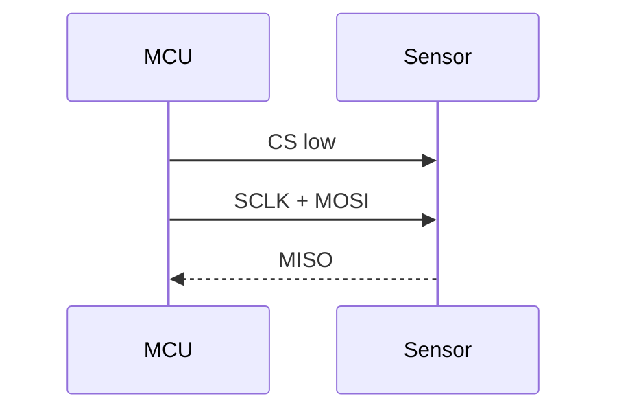

# Embedded Study Hub

Personal, Vercel-deployable study app for embedded systems preparation: CAN, SPI, FreeRTOS, toolchains, portfolio projects, and Japanese technical vocabulary.

## Quick start

```bash
npm install
npm run seed
npm run dev
```

Open <http://localhost:3000>.

## Deploy to Vercel in 3 clicks

1. Push this repository to GitHub.
2. Import the GitHub repository in Vercel and keep the default Next.js settings.
3. Click **Deploy**. `vercel.json` is already included for static-friendly Next.js deployment.

## Features

- Dark embedded-engineer dashboard with global search, status filter, level filter, category cards, and progress stats.
- Markdown study pages with GitHub-flavored Markdown, highlighted code blocks with copy buttons, responsive tables, Mermaid diagrams, quizzes, checklists, and a mark-complete action.
- Local progress persistence via `localStorage`, plus export/import from the Progress and Settings pages.
- Dedicated `/tests` Test Center that aggregates every `quiz.json` and saves scores automatically.
- EN/JP-ready UI structure and bilingual content convention.
- PWA manifest stub for installable behavior and future offline caching.

## Add a new study topic

Create a folder under `content/<category>/<slug>/index.md`:

````md
---
title: "SPI Timing Essentials"
category: "protocols"
tags: ["spi", "timing", "embedded"]
level: "Beginner"
estimatedTime: 30
status: "Not Started"
---

# SPI Timing Essentials

Write your lesson here.

```c
// Code blocks get syntax highlighting.
```


````

Optional Japanese version: add `index.ja.md` beside `index.md` for future bilingual rendering.

## Customize a quiz

Add `quiz.json` next to `index.md`; it appears both on the study page and in `/tests`:

```json
{
  "questions": [
    {
      "question": "What does EFLG report in MCP2515?",
      "options": ["GPIO state", "Error flags", "ADC value", "Clock speed"],
      "correct": 1,
      "explanation": "EFLG stores CAN controller error status bits."
    }
  ]
}
```

`correct` is the zero-based index in the `options` array.

## Export or import progress

- Go to `/progress` or `/settings`.
- Click **Export Progress** to download a JSON backup.
- Paste a backup into the import box and click **Import Progress** to restore it.

Progress is stored in the browser under the `embedded-study-progress` localStorage key. Supabase sync can be added later without blocking the MVP.

## Seed content

`npm run seed` creates missing starter files without overwriting existing notes. The repository already includes complete seed topics for:

1. `protocols/can-bus`
2. `rtos/freertos-basics`
3. `japanese/technical-terms`

## Useful scripts

```bash
npm run dev      # local development
npm run build    # production build check
npm run start    # serve a production build
npm run seed     # create missing sample content
```
