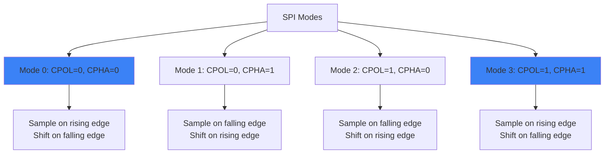
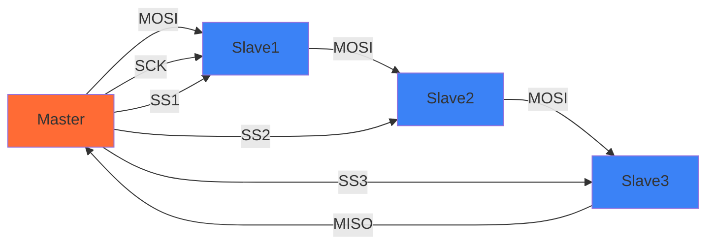

# SPI Protocol Basics 🔌

## Overview

Serial Peripheral Interface (SPI) is a synchronous serial communication interface used for short-distance communication between microcontrollers and peripherals like sensors, SD cards, and display modules.

## Key Characteristics

- **Synchronous**: Clock signal synchronizes data transfer
- **Full-duplex**: Data can be sent and received simultaneously
- **Master-slave**: One master controls one or more slaves
- **4-wire interface**: MOSI, MISO, SCK, SS/CS

## Signal Lines

| Signal | Name | Description | Direction |
|--------|------|-------------|-----------|
| MOSI | Master Out Slave In | Data from master to slave | Master → Slave |
| MISO | Master In Slave Out | Data from slave to master | Slave → Master |
| SCK/SCLK | Serial Clock | Clock generated by master | Master → All |
| SS/CS | Slave Select/Chip Select | Activates specific slave | Master → Slave |

## Communication Modes

SPI has 4 clock polarity and phase modes:



### Mode Details

- **CPOL (Clock Polarity)**: Determines idle state of clock
  - CPOL=0: Clock idles LOW
  - CPOL=1: Clock idles HIGH

- **CPHA (Clock Phase)**: Determines when data is sampled
  - CPHA=0: Sample on first edge
  - CPHA=1: Sample on second edge

## Daisy Chain Configuration

Multiple SPI devices can be connected:



## Arduino Example

```c
#include <SPI.h>

const int SS_PIN = 10;

void setup() {
  pinMode(SS_PIN, OUTPUT);
  digitalWrite(SS_PIN, HIGH);  // Deselect slave
  
  SPI.begin();
  SPI.setClockDivider(SPI_CLOCK_DIV4);  // 4MHz @ 16MHz system clock
  SPI.setDataMode(SPI_MODE0);
  SPI.setBitOrder(MSBFIRST);
}

void loop() {
  digitalWrite(SS_PIN, LOW);  // Select slave
  
  // Send and receive data
  uint8_t response = SPI.transfer(0x55);
  
  digitalWrite(SS_PIN, HIGH);  // Deselect slave
  
  delay(100);
}
```

## Common Issues

### 1. No Communication
- ✅ Check SS/CS pin is correctly driven LOW
- ✅ Verify SPI mode matches device requirements
- ✅ Ensure common ground connection

### 2. Corrupted Data
- ✅ Reduce clock speed
- ✅ Check wire length (keep short!)
- ✅ Add pull-up resistors if needed

### 3. Multiple Devices
- ✅ Use separate SS line for each device
- ✅ Only one device selected at a time
- ✅ Consider level shifters for mixed voltage

## Comparison with Other Protocols

| Feature | SPI | I2C | UART |
|---------|-----|-----|------|
| Wires | 4+ | 2 | 2 |
| Speed | High (up to 50+ Mbps) | Medium (up to 3.4 Mbps) | Low-Medium |
| Distance | Short (< 1m) | Short (< 1m) | Medium |
| Complexity | Simple | Moderate | Simple |
| Multi-master | No | Yes | No |

## Practice Exercise

Interface with an MCP2515 CAN controller via SPI:

```c
#define CNF1 0x2A
#define CNF2 0x2B
#define CNF3 0x2C

void mcp2515_init() {
  digitalWrite(SS_PIN, LOW);
  
  // Reset MCP2515
  SPI.transfer(0xC0);  // RESET command
  
  digitalWrite(SS_PIN, HIGH);
  delay(10);
  
  // Configure baud rate
  digitalWrite(SS_PIN, LOW);
  SPI.transfer(0x02);  // WRITE instruction
  SPI.transfer(CNF1);
  SPI.transfer(0x03);  // CNF1 value
  
  SPI.transfer(CNF2);
  SPI.transfer(0xAC);  // CNF2 value
  
  SPI.transfer(CNF3);
  SPI.transfer(0x47);  // CNF3 value
  
  digitalWrite(SS_PIN, HIGH);
}
```

## Key Takeaways

1. SPI is a simple, fast, synchronous protocol
2. Four modes based on clock polarity and phase
3. Each slave needs its own SS/CS line
4. Keep wires short for reliable high-speed communication
5. Master generates clock, controls all communication

---

**Next**: Learn about I2C for multi-drop sensor networks! 📡
