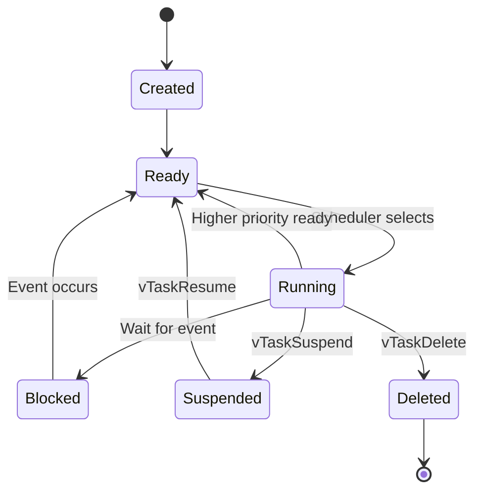

# FreeRTOS Basics 🧠

## Overview

FreeRTOS (Free Real-Time Operating System) is a popular open-source RTOS for embedded systems. It provides task scheduling, inter-task communication, and resource management for microcontrollers.

## Why Use an RTOS?

- **Multitasking**: Run multiple "threads" concurrently
- **Deterministic**: Predictable task scheduling
- **Resource management**: Safe sharing of peripherals
- **Modularity**: Easier to organize complex applications
- **Responsiveness**: Critical tasks get CPU time when needed

## Task vs Thread

| Aspect | Task (RTOS) | Thread (Desktop OS) |
|--------|-------------|---------------------|
| Stack size | Small (256-2048 bytes) | Large (MB range) |
| Context switch | Fast (µs) | Slower (ms) |
| Priority | Fixed priority | Dynamic/time-sliced |
| Memory | Static allocation common | Dynamic allocation |

## Creating a Task

```c
#include "FreeRTOS.h"
#include "task.h"

// Task function
void vTaskFunction(void *pvParameters) {
    char *taskName = (char *)pvParameters;
    
    while (1) {
        // Task code here
        printf("%s running\n", taskName);
        
        // Delay to prevent hogging CPU
        vTaskDelay(pdMS_TO_TICKS(100));
    }
}

// Create task in main or another task
xTaskCreate(
    vTaskFunction,           // Task function
    "Task1",                 // Name
    1024,                    // Stack size (words)
    (void *)"Hello",         // Parameter
    1,                       // Priority
    NULL                     // Task handle
);
```

## Task States



## Queue - Inter-Task Communication

```c
#include "queue.h"

// Create queue (10 items, each 4 bytes)
QueueHandle_t xQueue = xQueueCreate(10, sizeof(int32_t));

// Sender task
void vSenderTask(void *pvParameters) {
    int32_t value = 0;
    
    while (1) {
        // Send to queue (wait max 100 ticks)
        xQueueSend(xQueue, &value, pdMS_TO_TICKS(100));
        value++;
        vTaskDelay(pdMS_TO_TICKS(200));
    }
}

// Receiver task
void vReceiverTask(void *pvParameters) {
    int32_t receivedValue;
    
    while (1) {
        // Receive from queue (wait indefinitely)
        if (xQueueReceive(xQueue, &receivedValue, portMAX_DELAY) == pdPASS) {
            printf("Received: %ld\n", receivedValue);
        }
    }
}
```

## Semaphore Types

### Binary Semaphore

```c
SemaphoreHandle_t xBinarySemaphore = xSemaphoreCreateBinary();

// Give semaphore (in ISR or task)
xSemaphoreGiveFromISR(xBinarySemaphore, NULL);

// Take semaphore (in task)
if (xSemaphoreTake(xBinarySemaphore, pdMS_TO_TICKS(100)) == pdTRUE) {
    // Access shared resource
}
```

### Counting Semaphore

```c
// Create with max 10, initial 0
SemaphoreHandle_t xCountingSem = xSemaphoreCreateCounting(10, 0);
```

### Mutex (Mutual Exclusion)

```c
SemaphoreHandle_t xMutex = xSemaphoreCreateMutex();

// Access shared resource
if (xSemaphoreTake(xMutex, portMAX_DELAY) == pdTRUE) {
    // Critical section - exclusive access
    sharedVariable++;
    xSemaphoreGive(xMutex);
}
```

## Complete Example: LED Blink + Button Monitor

```c
#include "FreeRTOS.h"
#include "task.h"
#include "queue.h"

#define LED_PIN 13
#define BUTTON_PIN 2

// Queue for button events
QueueHandle_t buttonQueue;

// LED blink task
void vLEDTask(void *pvParameters) {
    const TickType_t delay = *(TickType_t *)pvParameters;
    
    while (1) {
        digitalWrite(LED_PIN, !digitalRead(LED_PIN));
        vTaskDelay(delay);
    }
}

// Button monitor task
void vButtonTask(void *pvParameters) {
    uint8_t buttonState;
    
    while (1) {
        buttonState = digitalRead(BUTTON_PIN);
        
        // Send to queue (non-blocking)
        xQueueSend(buttonQueue, &buttonState, 0);
        
        vTaskDelay(pdMS_TO_TICKS(50));  // Debounce
    }
}

// Command handler task
void vHandlerTask(void *pvParameters) {
    uint8_t buttonState;
    
    while (1) {
        // Wait for button event
        if (xQueueReceive(buttonQueue, &buttonState, portMAX_DELAY) == pdPASS) {
            if (buttonState == LOW) {
                printf("Button pressed!\n");
                // Trigger action
            }
        }
    }
}

void setup() {
    pinMode(LED_PIN, OUTPUT);
    pinMode(BUTTON_PIN, INPUT_PULLUP);
    
    // Create queue
    buttonQueue = xQueueCreate(5, sizeof(uint8_t));
    
    // Create tasks
    TickType_t fastDelay = pdMS_TO_TICKS(100);
    TickType_t slowDelay = pdMS_TO_TICKS(500);
    
    xTaskCreate(vLEDTask, "LED_Fast", 256, &fastDelay, 2, NULL);
    xTaskCreate(vLEDTask, "LED_Slow", 256, &slowDelay, 2, NULL);
    xTaskCreate(vButtonTask, "Button", 256, NULL, 3, NULL);
    xTaskCreate(vHandlerTask, "Handler", 512, NULL, 1, NULL);
    
    // Start scheduler
    vTaskStartScheduler();
}

void loop() {
    // Never reached when RTOS running
}
```

## Common Pitfalls

### 1. Stack Overflow

```c
// ❌ Too small stack
xTaskCreate(taskFunc, "Task", 64, NULL, 1, NULL);  // May crash!

// ✅ Check minimum required
xTaskCreate(taskFunc, "Task", 256, NULL, 1, NULL);  // Safer
```

### 2. Priority Inversion

```c
// ❌ Low priority holds mutex, high priority waits
// Medium priority preempts low → High priority blocked!

// ✅ Use mutex with priority inheritance
// FreeRTOS mutexes automatically handle this
```

### 3. Blocking in ISR Context

```c
// ❌ Never block in ISR!
void ISR_Handler() {
    vTaskDelay(100);  // WILL CRASH!
}

// ✅ Use FromISR functions
void ISR_Handler() {
    xSemaphoreGiveFromISR(xBinarySem, NULL);
}
```

## Debugging Tips

1. **Enable configUSE_TRACE_FACILITY** for task monitoring
2. **Use uxTaskGetStackHighWaterMark()** to check stack usage
3. **Monitor heap** with xPortGetFreeHeapSize()
4. **Check for errors** in task creation return values

## Key Takeaways

1. Tasks are independent threads of execution
2. Use queues for safe data exchange between tasks
3. Semaphores coordinate task execution
4. Mutexes protect shared resources
5. Always consider stack size and priority levels
6. Never block in interrupt service routines

## Next Steps

- Study task notifications for lightweight signaling
- Learn about software timers
- Explore memory management schemes (heap_1 through heap_5)
- Implement event groups for multi-event synchronization

---

**Practice**: Create two tasks that communicate via queue! 🎯
